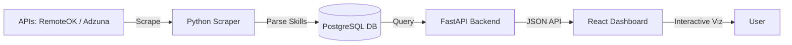

# 🚀 SkillTrend Analyzer

A full-stack job market intelligence platform that scrapes global job listings, extracts technical skills using NLP/regex, and visualizes demand trends in a premium React dashboard.


## ✨ Features
- **Automated Scraper**: Fetches 50+ jobs daily from RemoteOK and Adzuna APIs.
- **Skill Engine**: Detects 31+ specific technologies (Python, React, AWS, etc.) from raw descriptions.
- **Trend Analytics**: Visualizes skill demand over 12 months.
- **Heatmap Intelligence**: Maps skill co-occurrences to find "tech stacks" in high demand.
- **Idempotent Pipeline**: Ensures no duplicate data is stored even with multiple runs.

## 🛠 Tech Stack
- **Frontend**: React, Vite, Tailwind CSS, Recharts, TanStack Query.
- **Backend**: FastAPI, SQLAlchemy, PostgreSQL, APScheduler.
- **Infrastructure**: Docker, Railway (Backend), Vercel (Frontend).

## 🏃 Local Setup

### 1. Database
Ensure you have a PostgreSQL server running and create a database named `job_trends`.

### 2. Backend
```bash
# Install dependencies
pip install -r requirements.txt

# Configure environment
cp .env.example .env
# Edit .env with your DB credentials and Adzuna API keys

# Start the API and Scraper
python main.py  # Runs the initial scrape and starts the scheduler
uvicorn api_main:app --reload --port 8000
```

### 3. Frontend
```bash
cd frontend
npm install
npm run dev
```

## ⚙️ How It Works



1. **Scraper**: A scheduled Python task hits job APIs every 24h.
2. **Database**: Jobs and Skills are stored in a relational schema. `ON CONFLICT` logic ensures data integrity.
3. **API**: FastAPI provides optimized endpoints for trend analysis and paginated job searches.
4. **Dashboard**: The React frontend caches responses for 5 minutes and renders high-density charts using Recharts.

---
Built with ❤️ by Antigravity.
